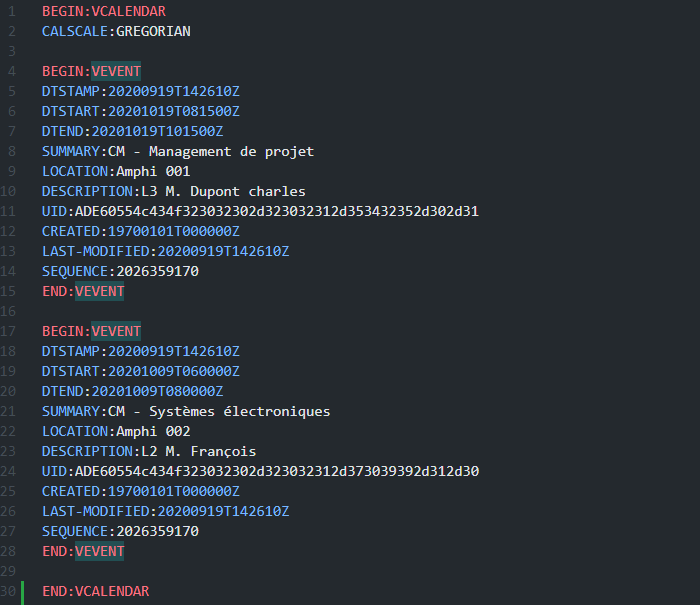
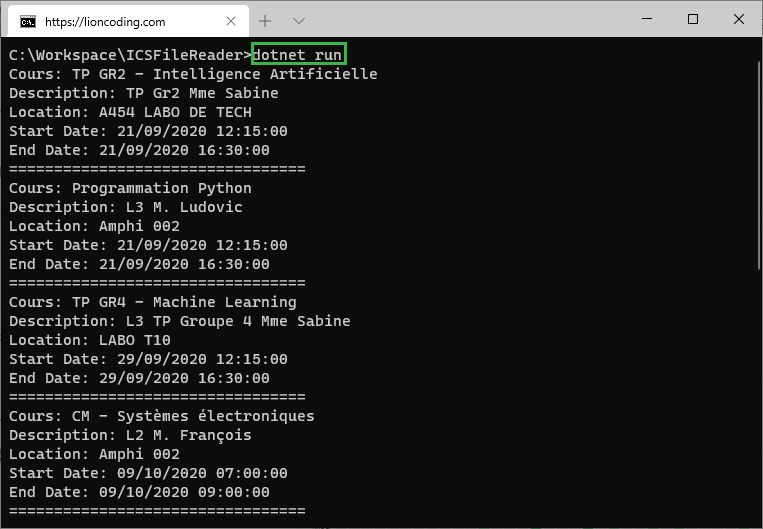

# ICalendar file reader sample

This is a sample demonstrates how to read data from remote or local ICalendar file especially **.ics** file.

## An Ics file content example

 

## .NET Console App reading remote ics file

## 